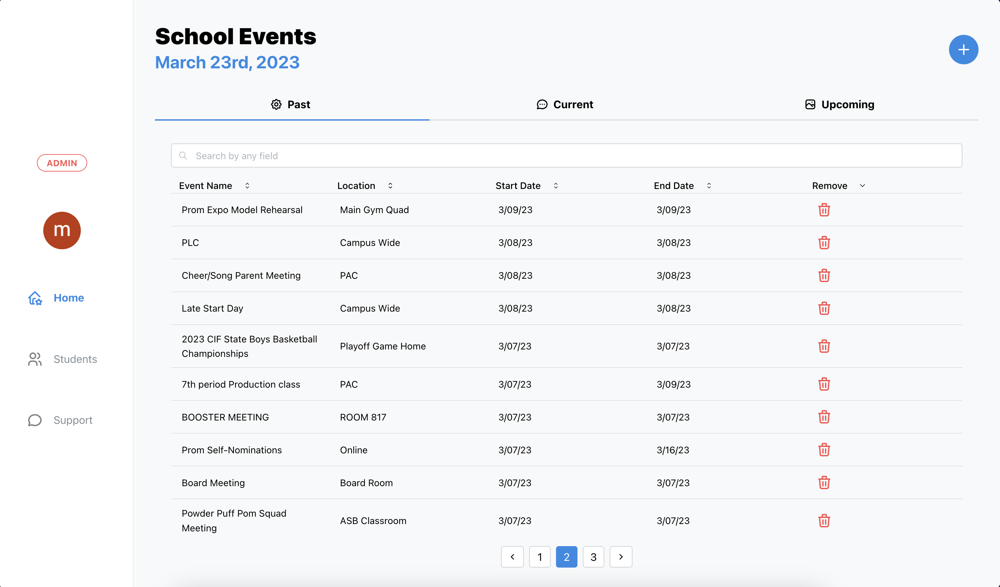
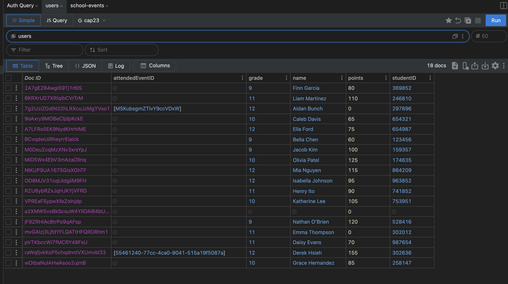

# MySchoolEvents
Welcome to MySchoolEvents, a web application designed to track student event attendance. This application is built using TypeScript and NextJS, with a backend implemented in Firebase, Firestore, and Auth.

MySchoolEvents provides both a student app and an admin dashboard, allowing for efficient management of student attendance records. The app is intuitive and user-friendly, making it easy for both students and administrators to use.

## Features
MySchoolEvents has several features that make it a powerful tool for tracking student event attendance, including:

MySchoolEvents offers a range of features that make it a comprehensive event management platform for schools:

- Student sign-up and check-in: Students can sign up and check-in to events using the student app, which provides a simple and user-friendly interface for students to browse events, view event details, and check-in to events.

- Course management: Students are able to create, edit and remove courses that they have in their schedule through the courses page. Our interface provides students with an easy way to quickly view their courses and teachers.

- Admin dashboard: The admin dashboard allows administrators to manage and track attendance records, as well as to create, edit and delete events. It also includes data analysis tools such as a dashboard for tracking student points, and generating winners for each quarter based on point accumulation.

- Event management: The app allows admins to create, edit and delete events with a variety of details including the event name, location, start and end dates, and confirmation ID for student check-ins. The home page also displays current, upcoming, and past events in a clear and organized way.

- Student list: The student list section provides admins with an organized table displaying all students in their organizations, including their avatar, display name, student ID, grade level, and point accumulation. The app includes data analysis tools for tracking student points, generating winners for each quarter, and exporting a CSV file with a spreadsheet report of all student data.

- Support chatbot: The app integrates with OpenAI's ChatGPT API to provide intelligent technical support to both students and admins. Using natural language processing, the chatbot can understand a wide range of queries related to the app, such as how to sign up for events, how to generate winners, and how to export student data.

- Firebase backend: The app is built using Firebase, which provides a reliable and secure platform for storing and accessing attendance data, with real-time updates and serverless functions for easy scaling.

- TypeScript and NextJS: The app is built using TypeScript and NextJS, providing a powerful set of tools for building scalable and maintainable web applications, with clear and organized code.

## Getting Started
To get started with MySchoolEvents, follow these steps:

1. Clone the repository to your local machine.
2. Install dependencies by running `yarn`.
3. Set up a Firebase project and add your Firebase credentials to the .env file.
4. Run the development server by running `yarn dev`.
5. Navigate to http://localhost:3000 to view the application.
6. Add the following environment variables to your .env.local file:
    - `OPENAI_API_KEY`: Your OpenAI API key. You can obtain a key by signing up for an account on the [OpenAI](https://openai.com/) website.
    - `FIREBASE_SERVICE_ACCOUNT_KEY`: Your Firebase service account key. You can obtain a key by creating a new service account in your Firebase project and downloading the JSON key file.
    - Make sure to include these variables in your .env.local file and add the file to your .gitignore file to keep your keys secure.

## Getting Help
If you have any questions or run into any issues with MySchoolEvents, please feel free to reach out to our team by opening an issue on our GitHub repository. We are always happy to help and are committed to providing a positive experience for all users of our application.

## Contributing
If you're interested in contributing to MySchoolEvents, we welcome your contributions! Please see our contributing guidelines for more information.
